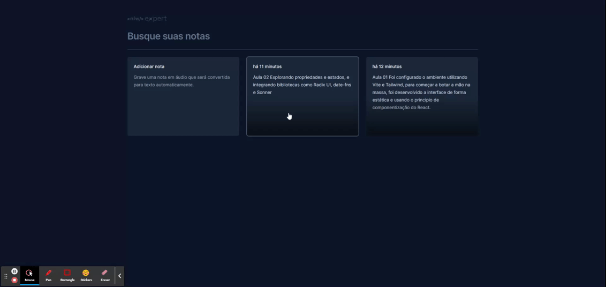

# Trilha de React NLW Expert

Este repositório engloba os recursos e informações associados à trilha de especialização em React NLW Expert.

## Aula 01
Foi configurado o ambiente utilizando [Vite](https://vitejs.dev/) e [Tailwind](https://tailwindcss.com/), para começar a botar a mão na massa, foi desenvolvido a interface de forma estática e usando o principio de componentização do React.

## Aula 02
Explorando propriedades e estados, e integrando bibliotecas como [Radix UI](https://www.radix-ui.com/), date-fns e [Sonner](https://sonner.emilkowal.ski/).

## Aula 03
Introduzindo o SpeechRecognition para converter áudio em notas. Implementando o Lifting State Up para gerenciar notas e persistência de dados com LocalStorage.

